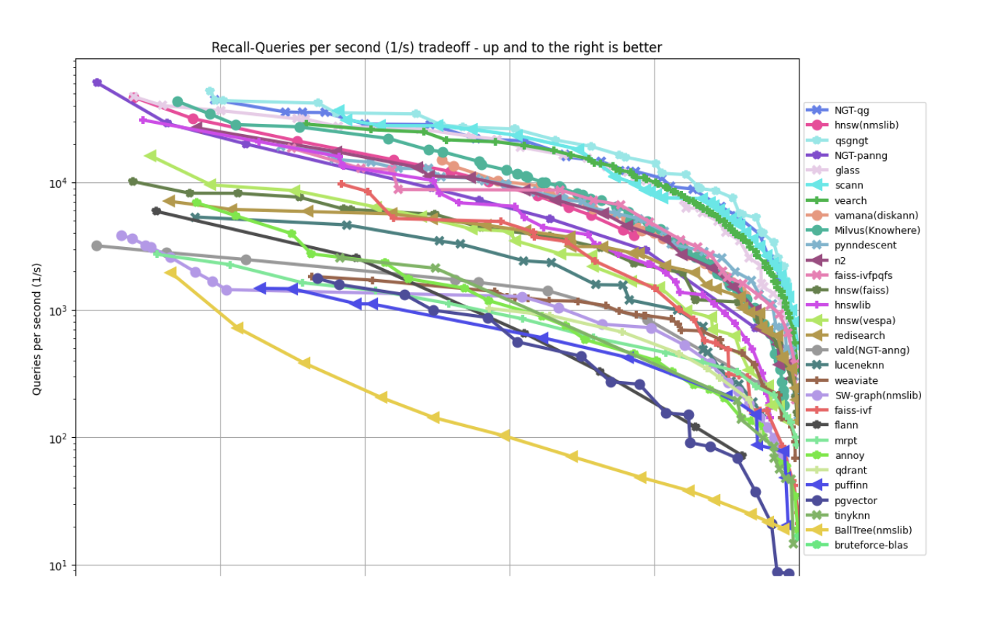

# Preparing Your Documents for RAG: VectorDB Options in AWS

The end of our journey will be  focusing on _storing_ and querying the embeddings and will focus on RAG systems.

Retrieval-Augmented Generation (RAG) is a framework that combines large language models with a retrieval system to access relevant external information. This allows the language model to "retrieve" and incorporate knowledge from a domain-specific corpus when generating text. Setting up an efficient RAG system requires careful consideration of the vector database used to store and retrieve relevant document embeddings.


## The Basics of RAG


At its core, a naive RAG system has the following components:

1. A query `q` from the user.
2. A collection of `N` document chunks `(d1, d2, ..., dN)`.
3. Two embedding systems:
    - An online system to embed the user query `q` into an embedding `Eq`.
    - An offline system to store embeddings `(E1, E2, ..., EN)` for the document chunks.
    - it is worth noting that RAG
4. A similarity calculation (e.g., cosine similarity) between the query embedding `Eq` and each document embedding `(E1, E2, ..., EN)`.
5. A ranking system to retrieve the top `K` most relevant document chunks based on the similarity scores.

While conceptually straightforward, this naive approach faces scalability challenges as the number of documents grows:

- Computational complexity increases linearly with the number of documents.
- Embedding models can increase latency and storage requirements.
- Larger embedding dimensions further increase storage needs.
- Aggressive document chunking increases computational overhead.

To overcome these challenges, modern vector databases employ indexing mechanisms that approximate the similarity search, balancing speed, accuracy, and memory usage.


## Knowledge Bases for Amazon Bedrock

Let's check it from the [AWS website](https://aws.amazon.com/bedrock/knowledge-bases/) :

> With Knowledge Bases for Amazon Bedrock, you can give FMs and agents contextual information from your company’s private data sources for Retrieval Augmented Generation (RAG) to deliver more relevant, accurate, and customized responses.

Said otherwise, it is an almost ready to go version of a RAG system!

### What do I need to create Knowledge Base?

Here is the bare minimum
* Data sources on S3
* A selected embedding model on Bedrock
* A vectorDB (the _quick create_ option will create an OpenSearch Serverless collection)

Here is a quick way to create a knowledge base in AWS:

### Console demo


_Et voilà !_

### How to query it ?

Then, you can query your RAG system as any other AWS service, with `boto3`in Python !

```python
import boto3
agentruntime_client = boto3.client('bedrock-agent-runtime')
question = "What is Amazon Bedrock?"
kb_config = {"knowledgeBaseId":"YourKnowledgeBaseId""modelArn":"arn:aws:bedrock:us-east-1::foundation-model/anthropic.claude-v2"}
res = agentruntime_client.retrieve_and_generate( input={'text': question},retrieveAndGenerateConfiguration={"type":"KNOWLEDGE_BASE", 'knowledgeBaseConfiguration':kb_config})
```

## Indexing Mechanisms for Vector Databases

To address the scalability challenges of RAG systems, modern vector databases employ various indexing mechanisms that approximate similarity search. These indexing techniques aim to strike a balance between speed, accuracy, and memory usage. Here are some of the most common indexing mechanisms:

### Flat Index (Brute Force)

The flat index, also known as brute force or exact search, compares the query embedding against all document embeddings in the vector store. This approach provides the highest accuracy but suffers from poor scalability as the number of embeddings grows. Flat indexing is recommended only when the number of embeddings is relatively small (e.g., below 100K) and latency is not a critical concern.

### Inverted File Index (IVF-flat)

The IVF-flat indexing method reduces the number of search operations by partitioning the embedding collection into non-overlapping regions using a k-means clustering algorithm. During indexing, a centroid is derived for each partition. At query time, the query embedding is compared against the partition centroids, and only the embeddings within the closest partition(s) are searched.

This approach significantly reduces the number of similarity calculations required, improving search speed while maintaining high accuracy. The number of partitions is typically set to the square root of the number of embeddings.

### Hierarchical Navigable Small World (HNSW)

HNSW is a graph-based indexing technique that represents embeddings as vertices in a navigable small-world graph. It creates multiple layers of this graph, with each layer progressively sparser, forming a hierarchy. Searching for the nearest neighbor starts at a random point on the sparsest layer and navigates down through the layers towards denser regions, allowing for efficient retrieval without examining the entire dataset.

HNSW is particularly effective for large collections of high-dimensional data, offering low latency and high accuracy at the cost of higher memory usage.

### Product Quantization (PQ)

Product Quantization is a lossy compression technique that splits high-dimensional vectors into subvectors, quantizing each subvector into a shorter representation. This approach reduces the memory footprint by storing only the compressed representations, trading off some accuracy for improved memory efficiency.

When choosing an indexing mechanism, consider the trade-offs between latency, accuracy, and memory usage based on your specific requirements. If memory is not a constraint, HNSW is generally recommended for its high performance. If latency is not critical and the dataset is small, flat indexing (brute force) may be suitable. For larger datasets with moderate memory constraints, IVF-flat can provide a good balance between speed and accuracy.

## Vector Database Options in AWS

Here are some popular vector database options available on AWS, along with their support for various indexing mechanisms:

| Service | Description | HNSW | IVF-flat | Dimension Limit | Fully-managed Bedrock KB Integration |
| --- | --- | --- | --- | --- | --- |
| PostgreSQL with pgvector (RDS or Aurora) | SQL-based vector database option, good for existing RDS or Aurora instances | Yes (pgvector 0.5+) | Yes | 2000 | Yes (for Aurora) |
| OpenSearch | Fully-managed, open-source search and analytics suite | Yes | No | 10000 | Yes |
| DocumentDB | Fully-managed MongoDB-compatible database service | Planned | Yes | 2000 | No |
| Redis | Open-source, in-memory data structure store | Yes | No | 32768 | Yes |
| Pinecone | Fully-managed vector database service optimized for ML workloads | Yes | Yes | 20000 | Yes |

## Choosing the Right VectorDB

When selecting a vector database for your RAG system, consider the following factors:

- **Existing data model and skillsets**: If you already have an RDS instance or experience with SQL workloads, PostgreSQL with pgvector may be the most intuitive choice.
- **Scalability requirements**: For large document collections, you may need a vector database that supports efficient indexing mechanisms like HNSW or IVF-flat.
- **Embedding dimensions**: Higher embedding dimensions may necessitate a vector database with a larger dimension limit.
- **Integration with Bedrock Knowledge Base**: If you plan to use Bedrock KB, choose a vector database that supports seamless integration, such as Aurora, OpenSearch  or Pinecone.

### Performance considerations.

Here's how the internal resource on performance considerations could be incorporated into the blog post, along with some additional context and recommendations:

## Performance Considerations for RAG Systems

When deploying a Retrieval-Augmented Generation (RAG) system, it's crucial to consider the performance implications of your chosen indexing mechanism. The choice of indexing technique involves trade-offs between three key dimensions: latency, accuracy, and memory usage.

### Trade-off Dimensions

| Dimension | Flat | HNSW | IVF-flat | Description
| --- | --- | --- | --- | --- |
| Latency | High | Low | Low | The time it takes to perform a similarity search and retrieve relevant documents. Low latency is essential for real-time applications. |
| Accuracy | High | High | High | The ability to retrieve the most relevant documents based on the query embedding. High accuracy is crucial for providing high-quality results. |
| Memory | High | High | Mid | The amount of memory required to store and index the document embeddings. Memory constraints can be a limiting factor, especially for large-scale deployments. |

#### Choosing the Right Indexing Mechanism

When selecting an indexing mechanism, consider the following guidelines:

1. **If memory is not a constraint**, the Hierarchical Navigable Small World (HNSW) indexing mechanism is generally recommended for its high performance and accuracy.

2. **If latency is not critical and the dataset is small**, flat indexing (brute force) can provide high accuracy while simplifying implementation.

3. **If memory usage and latency are both important factors**, the Inverted File Index (IVF-flat) approach can strike a good balance between speed, accuracy, and memory efficiency.

#### Benchmarking and Trade-off Analysis

Evaluating the performance of different indexing mechanisms is essential for making an informed decision. The [ann-benchmark](https://github.com/erikbern/ann-benchmarks) repository provides a comprehensive comparison of approximate nearest neighbor search algorithms across various datasets and metrics.

Two key metrics used in ann-benchmark are:

- **QPS (Queries per Second)**: A measure of search speed, indicating the number of queries that can be processed per second.
- **Recall**: A measure of search quality, representing the proportion of true nearest neighbors found.

The trade-off between QPS and Recall is often visualized using plots like the one below, which shows the performance of multiple indexing methods on the `glove100-angular` dataset:





Beyond the indexing mechanism, you can also use - **embedding caching**: caching embeddings for frequently accessed documents or frequently asked questions can significantly reduce computation overhead.


### Advanced RAG Techniques

While the core RAG framework is powerful, researchers have developed advanced techniques to further improve performance and accuracy. Two notable approaches are Query Rewriting and Hypothetical Document Embeddings (HyDE).

#### Query Rewriting
Query rewriting aims to enhance retrieval performance by reformulating the input query before passing it to the retrieval system. A trained rewriter model can rephrase the query to better align with the document collection, maximizing the chances of retrieving relevant information.

The rewriter model is typically trained on a dataset of query-document pairs, learning to transform queries into forms that improve retrieval accuracy. During inference, the rewritten query is encoded and used for similarity search against the document embeddings.

#### Hypothetical Document Embeddings (HyDE)
The HyDE approach generates a "hypothetical document" based on the initial query using a language model. This hypothetical document acts as a proxy for the desired information and is encoded into an embedding by a "contriever" model trained via contrastive learning.

The contriever model learns to map relevant document-query pairs to similar embeddings while pushing irrelevant pairs apart in the embedding space. During retrieval, the hypothetical document embedding is used to find the nearest neighbors from the document collection.

HyDE has shown comparable or better performance than fine-tuned models while being more efficient and requiring less task-specific data.

Both Query Rewriting and HyDE have demonstrated promising results in improving the accuracy and efficiency of RAG systems. However, they may introduce additional complexity and computational overhead, so the trade-offs should be carefully evaluated based on the specific requirements of your use case.

## Recap

This blog post explored the world of Retrieval-Augmented Generation (RAG) systems and the critical role of vector databases in storing and retrieving document embeddings efficiently. We discussed various indexing mechanisms like Flat, IVF-flat, HNSW, and PQ, each offering trade-offs between speed, accuracy, and memory usage.

We then focused on vector database options within AWS, comparing services like PostgreSQL with pgvector, OpenSearch, DocumentDB, Redis, and Pinecone in terms of indexing support, dimension limits, and Bedrock KB integration.

Performance considerations were highlighted, emphasizing the importance of understanding the latency, accuracy, and memory trade-offs for each indexing technique. We introduced benchmarking resources and visualized the QPS vs. Recall trade-off.

Finally, we touched upon advanced RAG techniques like Query Rewriting and Hypothetical Document Embeddings (HyDE), which can potentially enhance performance and accuracy, albeit with increased complexity.

As RAG systems continue to evolve, efficient vector databases and indexing mechanisms will play a crucial role in enabling language models to access and incorporate relevant information accurately.