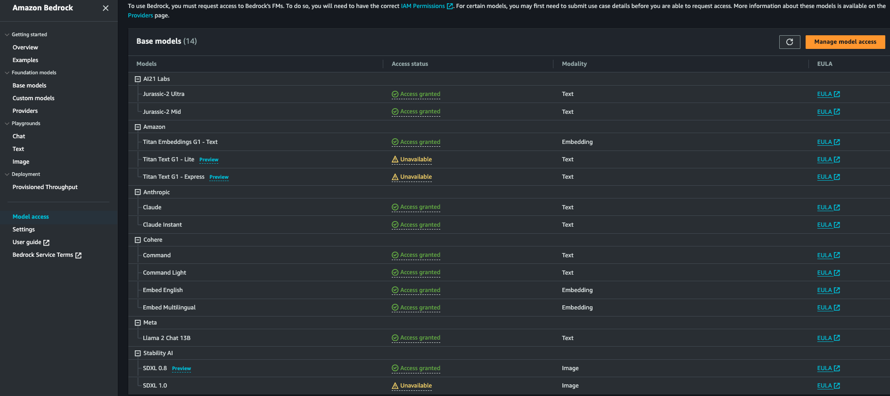
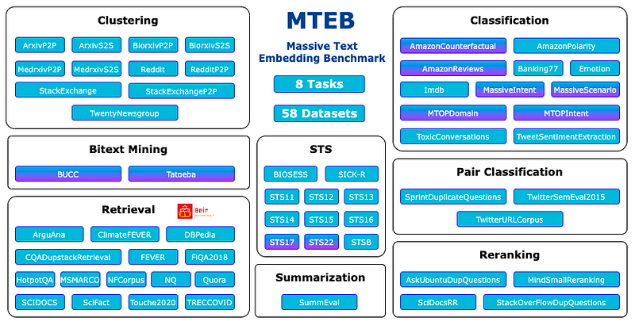
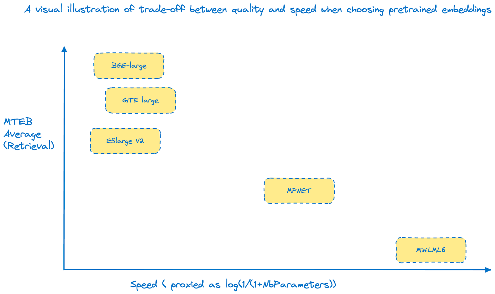

#### _The Cloud Embedding Series_
# Selecting and evaluating embeddings with  BedRock, HuggingFace, SageMaker and MTEB

In [introduction](https://mnemlaghi.github.io/cloud-embeddings/), we gathered some historical perspective and highlighted the importance of word embeddings in our current era. Now we're going to select and find a framework to evaluate them! Beforehand, let's make a quick detour with pre-trained embeddings.

## The virtues of pretrained embeddings

### Is training its own embedding from scratch always a good idea?

The attentive reader might think twice before going further: "*Please wait a minute: shouldn't we gather and curate tons of data beforehand and train our own embedding system from scratch?*".

To answer concisely: if you want to learn the intrinsics of it, it is absolutely advised. But, in a real-world case, unless you have an exceptionally specific use-case and/or a substantial budget for training embeddings from scratch - a process demanding significant GPU resources over multiple days, especially in today's resource-constrained environment - it is advisable to avoid training embeddings from scratch. Furthermore, leveraging external - common, non-domain specific - knowledge derived from pre-trained embeddings can serve as a solid foundation, allowing you to capture essential linguistic nuances and patterns that form the basis of effective natural language processing models.
So please allow me to make a quick detour with a running metaphor with transfer learning.

### Transfer learning: from marathon to scripts

Imagine you're preparing a group of athletes for a variety of races, from marathons to sprints. You start with a well-trained marathon runner who has built up incredible endurance through rigorous training. This runner serves as your baseline, representing the knowledge and skills acquired from a specific task, e.g. running the long run.

Your use-case is quite different though: your runners need to perform the 1000 meters sprint. While this race is shorter and requires a different set of skills, you can easily find that the core fitness and endurance developed by your marathon runner could be at the very least… valuable. This is where transfer learning comes into play.


In the same way that you don't start from scratch when training your marathon runner for a sprint, you can leverage pretrained embeddings in transfer learning. These embeddings, like the runner's endurance, capture valuable information from a previous task, such as language understanding in NLP. Just as the marathon runner fine-tunes their training regimen to thrive in a 1000 meters sprint, you can fine-tune the pretrained embeddings to improve performance on a specific NLP task, such as sentiment analysis. Also, due to their versatility, you can also fine-tune the pretrained embeddings to capture a specific domain vocabulary.

Over the last few years, we noticed a change in the ML paradigm. Open-source model development has led multiple organizations to share their already trained models on massive amounts of data, alongside improving training techniques, which allows models to be commoditized in over-the-shelf fashion, and fine-tuned for specific usage.


## Following AWS Well-Architected ML best practices.

Taking advantage of transfer learning by fetching OSS components is a game changer in Machine Learning. In fact, this operating mode is a best practice by [AWS Well architected](https://medium.com/r/?url=https%3A%2F%2Faws.amazon.com%2Farchitecture%2Fwell-architected%2F%3Fwa-lens-whitepapers.sort-by%3Ditem.additionalFields.sortDate%26wa-lens-whitepapers.sort-order%3Ddesc%26wa-guidance-whitepapers.sort-by%3Ditem.additionalFields.sortDate%26wa-guidance-whitepapers.sort-order%3Ddesc) standards.


An [ML-lens](https://medium.com/r/?url=https%3A%2F%2Fdocs.aws.amazon.com%2Fwellarchitected%2Flatest%2Fmachine-learning-lens%2Fmachine-learning-lens.html) version of the well-architected framework provides two proven best practices:
* The performance efficiency part: Using pre-built components ([MLPER02](https://medium.com/r/?url=https%3A%2F%2Fdocs.aws.amazon.com%2Fwellarchitected%2Flatest%2Fmachine-learning-lens%2Fmlper-02.html))
* The sustainability pillar: Consider pre-trained services ([MLSUS02](https://medium.com/r/?url=https%3A%2F%2Fdocs.aws.amazon.com%2Fwellarchitected%2Flatest%2Fmachine-learning-lens%2Fmlsus-02.html))

In plain English, using pre-trained embeddings is not only a time catalyzer in ML development, but it's also a low-carbon footprint approach.

## Selecting pre-trained embeddings: navigating through the model zoo.

### Some context

In this first part, we are going to plunge into the fascinating universe of pre-trained text embeddings: how it can help your organization to quickly build effective ML systems, how to select and evaluate the right model and how to fine-tune them. Goal of this part is to be accessible for everyone!
Having said that, where to start? In 2023, there's a plethora of avenues in order to select a pre-trained embedding system. Multiple options are available for developers, from the most generic/highest level embeddings to the most specific/customizable ones. Let's review them:


### Proprietary solutions

At the highest level, you can fetch purpose-built  embeddings by subscribing to an API: for instance, Amazon Bedrock provides the ability to fetch numerical representations of sentences (similar to OpenAI embeddings, such as `ada`). 

#### Bedrock embeddings


Generative AI is not limited to text generation. As a matter of fact, the type of content generated (or inputted) by a model is called a _modality_. Embeddings belong to these modalities. You can find embeddings in the "Foundation models" -> "Base models" section of Bedrock in your Amazon console.


✍🏼 Since these models are provided by external providers, an active EULA is necessary beforehand. It takes a couple of clicks with Amazon Bedrock toto agree and use the model: 
- go to "Model access" on the left bar of Bedrock console;
- revise the EULA specifics on the desired model;
- check the right box on a model.

Then you're good to go! To this date, two providers offer embedding models: Amazon and Cohere. 

 

We'll test both of them below for a retrieval task; this will be the opportunity for us to interact with its API a bit more!

### SageMaker Jumpstart: highway to open-source embeddings

Let's begin by briefly define SageMaker: an umbrella of AWS services allowing builders to effectively develop, train and deploy machine learning models. Much, much more than a simple "cloud notebook", SageMaker offers tools destined to diverse AI skills

From its description, [SageMaker Jumpstart](https://medium.com/r/?url=https%3A%2F%2Fdocs.aws.amazon.com%2Fsagemaker%2Flatest%2Fdg%2Fstudio-jumpstart.html) takes the logic further by directly providing a wide range of pretrained models and solutions, in a click-button manner. It removes the hassle of deploying models manually or losing time in configuring options. Let's see how Jumpstart helps us in quickly selecting embedding models and deploy them to production:

1. if it doesn't exist yet, create a SageMaker Studio Domain. SageMaker Studio acts as a centralized IDE for handling ML workflow. Among other appreciable features, notebooks launch faster than usual SageMaker notebooks and easy integrations with other data related services, such as Glue. 
2. Launch a domain
3. On the left tab of the IDE launcher, click on SageMaker Jumpstart
4. Click on the ML task type: "text embeddings" you'll find a repository full of pretrained embeddings that you can easily deploy in a single click 
5. Deployment is just one click away. You'll have your valid endpoint already configured.

A GIF is worth a thousand words:

[


## HuggingFace hub and Sentence Transformers.

[HuggingFace](https://huggingface.co/) is a stunning initiative that develops tools for machine learning models, mostly in open-source flavor.

Amongst other features, they provide a hub where you can easily find an open-source model suited to your needs. From their [Hub](https://medium.com/r/?url=https%3A%2F%2Fhuggingface.co%2Fdocs%2Fhub%2Findex) description page:

>  "The Hugging Face Hub is a platform with over 120k models, 20k datasets, and 50k demo apps (Spaces), all open source and publicly available, in an online platform where people can easily collaborate and build ML together."


Furthermore, you can derive encoders from HuggingFace transformer embeddings with the code snippet below and/or leverage [Sentence Transformers](https://medium.com/r/?url=https%3A%2F%2Fwww.sbert.net%2F) library, which is a powerful library containing pretrained embeddings, but for sentences.

Wow, we went from zero to dozens! How can we choose from all of the pretrained options? This is where evaluation comes into play.

## Evaluating pre-trained embeddings

Embeddings are ML systems that do not escape to fall into the classical project where one might choose to optimize cost, delay and quality.

Development costs and delays (in time to deliver angle) are already optimized since most of the time, we don't need to train from scratch. Let's focus now on the deployment aspect of embeddings. Hence, we need to make informed decisions based on multiple criteria. We'll focus on two criteria groups:

* *Inference-based*: how well your embedding system will perform when plunged into a real-world system. Here, we need to focus on inference latency, e.g. time to deliver an embedding when requesting with a text. Multiple criteria impact this latency, such as instance, memory, vector store size…
* *Quality-based* : to what extent the chosen embedding system will perform on my specific real-world task?

### Inference-based criteria

When determining the optimal embedding model for your use-case, it's essential to consider various inference criteria, particularly with respect to latency requirements. These criteria are independent of the instance they'll be deployed upon and will include:

* _Pretrained Model Size_: This metric refers to the number of parameters within the model. It holds significance not only when fine-tuning the model but also when deploying it within an instance. A smaller pretrained model size can lead to faster inference times and more efficient resource utilization,making it an important consideration for real-time applications.Models with a smaller memory footprint are generally easier to deploy and maintain.
* _Embedding Size_: The embedding size denotes the dimension of the resulting vector space, often measured in terms of the number of scalars compounding the vector. This dimensionality directly impacts the richness and complexity of the captured semantic information. While a higher embedding size can potentially yield more nuanced representations, it may also lead to increased computational demands during inference. Striking the right balance between embedding size and computational efficiency is crucial when deploying your model. It's an important criteria, subject to a trade-off, as per:
* The bigger dimension is, the more algebraic operations (*FLOPS*) will be performed, thus expanding the memory footprint;
* The larger the dimension, the larger the subsequent storage.


## Quality criteria: introducing Massive Text Embedding Benchmark.

At the start of our blog post, we began by stating that embeddings are vehicles. Turning a document into a list of words doesn't have an interest _per se_. Embeddings are good instruments for accomplishing downstream tasks, and a builder might focus on the latter when developing the former.

At this stage, you have two avenues:
* You already have your own evaluation dataset. Henceforth, you might just need an evaluation metric to assess the quality of your embedding.
* You don't have any evaluation dataset yet - a common pitfall in many organizations.

Fortunately, there's a brand new *de facto* standard toolset aiming at effectively selecting your embedding model, depending on your task. Enter MTEB!

Released in late 2022, Massive Training Embedding Benchmark ([MTEB](https://medium.com/r?url=https%3A%2F%2Fgithub.com%2Fembeddings-benchmark%2Fmteb)) is a library that provides an off the shelf evaluation of many embedding systems, including OpenAI's. Alongside this powerful library, a leaderboard is also available. At the time of writing, the leaderboard is dominated by a blend of proprietary and open source solutions, such as Cohere, BGE, GTE families and GTE.


### How to use MTEB?

1. Define the task you want to perform with embeddings. If you don't find the task you'd like to perform, choose the closest one. Image below (source in announcement).
2. Define the language. It's a hard constraint, since most of the models are trained with English data, but there are lots of highly performant open available multilingual embedding models
3. Start with the best trade-off model between the number of parameters (or model size) and ranking of your selected tasks. Number of parameters or model size can be seen as a weak proxy of inference speed



### Analyzing data on retrieval task for several pre-trained models

Assuming we'd want to perform retrieval augmented generation, we'd need a strong retriever. MTEB includes BEIR benchmark, on-purpose benchmark for retrieval. Let's first select a task suitable for Retrieval.

#### _The task: science!_


 The growing number of academic papers poses a challenge for scientists and practitioners who need to verify the accuracy of scientific claims. [Scifact](https://allenai.org/data/scifact) provides a collection of  expert claims alongside abstracts, with veracity labels that support or refute the claims. We can frame it as a fact-checking dataset, which is in line with RAG purpose: extracting facts ! Evaluation is about correctly predicting whether an evidence supports, contradicts or is neutral to a given scientific claim. Reference score is normalized discount gain @ 10.


#### Provisioned throughputs in Bedrock

Additionally, when using Amazon Bedrock, especially for large workloads or when strict latency requirements are in place, you have the option to enhance both performance and inference speed by utilizing the provisioned throughput mode.

In this pricing model, you can purchase a specific number of "model units," which can be measured as the equivalent to a maximum number of token inputs and outputs per minute. By committing to this arrangement for a set period, typically 1 or 6 months, you can ensure that your embedding system operates at its maximum capacity.


## MTEB 🫱🏾‍🫲🏻 SageMaker processing

When MTEB furnishes the evaluation canvas, we might chase for some computing resources: indeed, some tasks require heavy computation. In the [evaluation part of the repository](https://medium.com/r/?url=https%3A%2F%2Fgithub.com%2FmNemlaghi%2Fcloud-embeddings%2Fblob%2Fmain%2Fevaluate%2Fmteb_evaluate.ipynb), I wrote down a script to take advantage from MTEB, BedRock and SageMaker processing. Here's an excerpt from the notebook, where I spin up a PyTorch processor (HuggingFace processor doesn't support yet CPU only processing) with SageMaker SDK.


```python
from sagemaker.pytorch import PyTorchProcessor
from sagemaker.processing import ProcessingInput, ProcessingOutput
from sagemaker import get_execution_role, session

sagemaker_session=session.Session()

BUCKET=sagemaker_session.default_bucket()
S3_OUTPUT_PATH="mteb/eval"

###[...]

def run_sm_processing_job(model_name, script_dir = "sbertscripts"):
    #Initialize the PyTorch Processor
    model_suffix = model_name.split('/')[-1]
    hfp = PyTorchProcessor(
        role=get_execution_role(), 
        instance_count=1,
        instance_type='ml.m5.2xlarge',
        framework_version='1.13.1',
        base_job_name=f"mteb-eval-{model_suffix}",
        py_version="py39",
        max_runtime_in_seconds=600
    )

    #Run the processing job
    s3_destination=f's3://{BUCKET}/{S3_OUTPUT_PATH}/{model_name}'
    runnah=hfp.run(
        code='embeval.py',
        source_dir=script_dir,
        outputs=[
            ProcessingOutput(output_name='eval', source='/opt/ml/processing/eval/', destination=s3_destination)
        ],
        arguments = ["--model-name", model_name], 
        wait=False
    )
    return {"s3eval":s3_destination, "model_name":model_name, "processor":hfp}
```


### The case of BedRock

As usual, using AWS APIs require proper and well bounded authorization through IAM.

🔐 : If you want to evaluate BedRock inside a SageMaker processing job, the IAM role executing the SageMaker processing job must have the relevant permissions. More specifically, we might want to invoke the Titan embedding model. Here's a working example of a proper policy, where a user can invoke two models.


```json
{
	"Version": "2012-10-17",
	"Statement": [
		{
			"Sid": "VisualEditor0",
			"Effect": "Allow",
			"Action": "bedrock:InvokeModel",
			"Resource": ["arn:aws:bedrock:*::foundation-model/amazon.titan-embed-text-v1", "arn:aws:bedrock:*::foundation-model/cohere.embed-english-v3"]
		}
	]
}
```


#### __Titan embeddings__

Now for the script itself, MTEB reveals itself to be flexible, allowing for API based embeddings. All we need is to create a class with an `encode` method taking list of sentences as inputs and returning list of embeddings as outputs, and we're good to go!

```python

client = boto3.Session(region_name='us-east-1').client('bedrock-runtime')

#[...]

class NaiveTitanEmbedding():
    def encode(self, sentences, batch_size=4, **kwargs):
        """ Returns a list of embeddings for the given sentences.
        Args:
            sentences (`List[str]`): List of sentences to encode
            batch_size (`int`): Batch size for the encoding

        Returns:
            `List[np.ndarray]` or `List[tensor]`: List of embeddings for the given sentences
        """
        nb_sentences = len(sentences)
        nb_chunks = nb_sentences // batch_size + 1
        res = []
        for i in range(nb_chunks):
            batch=sentences[(i*batch_size):((i*batch_size)+batch_size)]
            encoded = self.batch_encode(batch)
            res.extend(encoded)
        return res
    
    def call_bedrock(self, sentence):
        data = {"inputText": sentence} 
        body = json.dumps(data)
        response = client.invoke_model(body=body, modelId="amazon.titan-embed-text-v1", accept='''*/*''', contentType=contentType)
        response_body = json.loads(response.get('body').read())
        x = np.array(response_body['embedding'])
        return x
    
    def batch_encode(self, batch):
        l=Parallel(n_jobs=-1, prefer="threads")( delayed(self.call_bedrock)(s) for s in batch)
        return l


#[...]
model = NaiveTitanEmbedding()
evaluation = MTEB(tasks=["SciFact"])
evaluation.run(model, eval_splits=["test"], output_folder=output_path_folder)
```

At the time of writing this post, Titan doesn't provide batch encoding. With the help of `joblib` library, I circumvented the challenge in order to speed up the operations on Titan.

We found a SciFact score of 73.5.

#### __Cohere embeddings__

[Cohere](https://cohere.com/) is a foundation models provider that focuses on professional AI LLM. The `v3` version of their embeddings API [Co.Embed](https://docs.cohere.com/reference/embed) includes the ability to specify the intended use for the embedding, by requesting their API users to put one of numerous `input_type` on their request : `search_documents`, `search_query`, `classification`, or `clustering`. 

Moreover, it supports mulltilingual embeddings, with more than [100 languages](https://docs.cohere.com/docs/language-detection), and server-side batching up to 96 texts. 

On MTEB, they report a solid 71.83 on SciFact.


#### __Results__ 

Now we'll pick up several  embedding models and synthesize them in the following tab.


Pretrained embedding | Number of parameters | Embedding dimension | SciFact Retrieval score
---------------------| --------------------- | --------------------- |--------------------
GTE base |768| 110M| 76.18
BGE large |335M| 1024| 74.61
GTE large |330M| 768| 74.27
Titan Embedding | | 1536| 73.5
Cohere Embedding (v3)| | 1024| 71.83
E5LargeV2 |335M| 1024| 72.58
mpNet |109M| 768| 65.57
miniLML6 |22M| 384| 64.51


As per SciFact evaluation, bigger isn't always better. SOTA is achieved with GTE; even better, its _base_ flavor out performs its thrice bigger _large_ counterpart by a margin of almost 2 points!


### _Key take-aways_



Here are some take aways:
* First, this graph __purposely__ doesn't contain any absolute value. Scores are amongst the best either way, and log(1/(1+NbParameters)) is a proxy heuristic for speed. It's a comparison-based companion.
* Second: it only includes open source solutions. Proprietary solutions include lightweight versions of their embeddings. 
* We roughly distinguish 3 clusters:
    * Top of class embeddings: BGE, GTE and E5 in their large version but with relatively high number of parameters
*   Compact speedy embeddings, such as MiniLML6, with honorable performance
*   Sweet spot between speed and quality, as embodied by MPNET

As you can observe, there's no such thing as free lunch. A trade-off between quality and latency has to be specified, depending on your needs.

NB: when I state "high number of parameters" for top of class, it is still several *orders of magnitude* below large language models. All things considered, these embeddings are very tiny in regard to the current wave of trillions-based LLMs!

## Recap and what's next

There was a lot to unfold out there!

👉🏽 We praised the virtues of selecting a pre-trained embedding - with comparison to training a model from scratch.

👉🏽 We gave some hints on searching pre-trained text-embeddings, including Bedrock and SageMaker JumpStart options.

👉🏽 We discovered MTEB, new standard for evaluating text embeddings.

👉🏽 We  selected two embeddings: on one hand, Cohere for its practicity and performance, and, on the other hand,  BGE General Embedding for its relative compacity and top performance.

Next, we'll talk about [LoRA fine-tuning for embeddings](https://mnemlaghi.github.io/cloud-embeddings/part-two-finetune). If you want to skip it, you can directly jump to [part 3](https://mnemlaghi.github.io/cloud-embeddings/part-three-deploy), dedicated on repeatable embeddings deployment