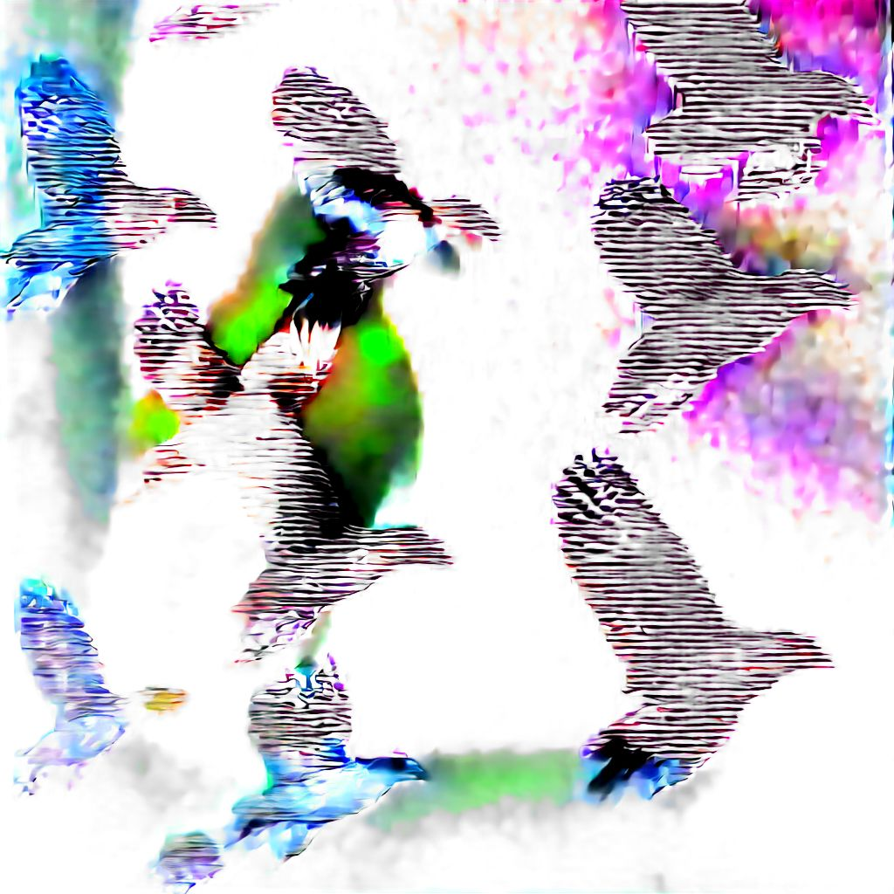
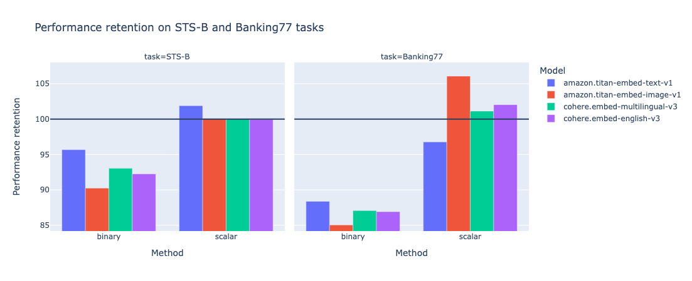
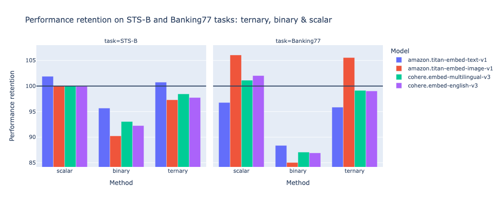
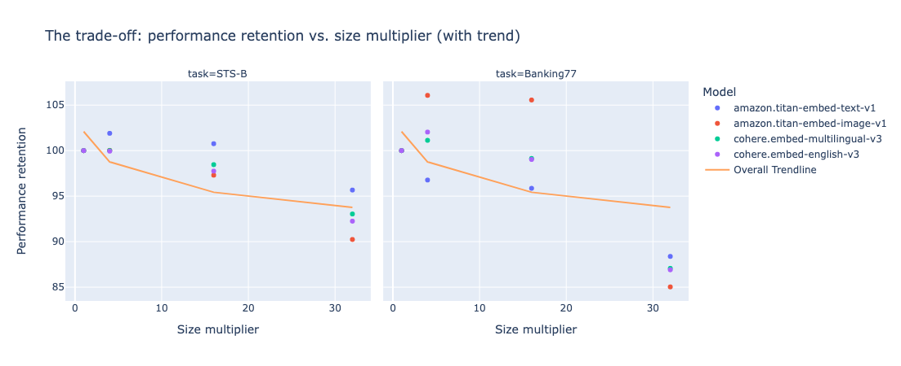
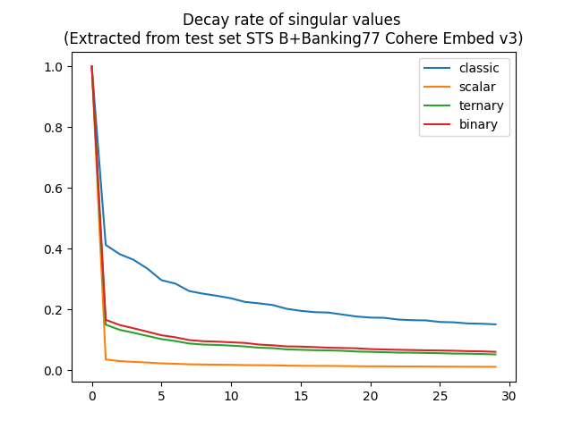
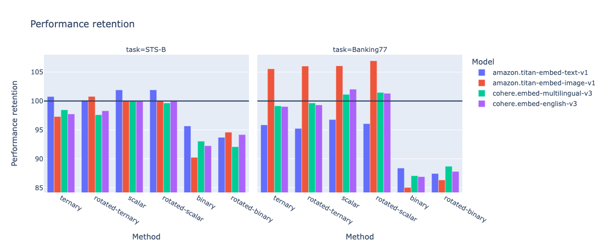
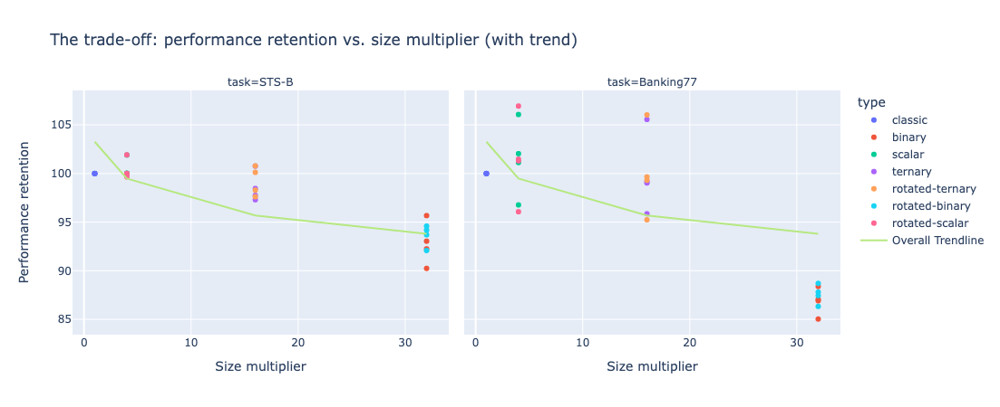

# Squeezing Embeddings: A Journey from classic to rotated ternary quantization

## Why is that important?


### The scaling challenge

Dear friends, you have surely heard that deploying massive language models on devices with limited resources is a challenging task for successful scaling in AI. _Spoiler alert_: I'm afraid that this statement also applies to embeddings, that I annoyed you so much about. Yes, even if you have thoroughly [selected and evaluated them](https://mnemlaghi.github.io/cloud-embeddings/part-one-evaluate). Even if you chose a [repeatable deployment strategy](https://mnemlaghi.github.io/cloud-embeddings/part-three-deploy). Sadly, it also applies if you chose the [best VectorDB option in the market](https://mnemlaghi.github.io/cloud-embeddings/part-four-store).

Or, translating with the current hype, the "R" part of any RAG system can bring challenges along at scale. Assume you trained/use the perfect embedding  for your application, let's assume its underlying embedding model is of dimension 1536, which means that each embedding chunk will be stored into a 1536 x 4 (32 bytes float number, e.g. 8 x 4) = 6144 bytes vector. You might say that's fine. Now multiply each sentence by 1 million. Computation apart, the mere storing requires now, at the very least 6.144 GB. How to keep the magic when you multiply again by 1000? You'll probably say "that's fine, I don't have 1M rows". Well, wait until you read any advanced RAG strategy out there.


### Current solutions

This is why embeddings compression - and, more broadly language models compression - is currently a hot topic. [Matryoshka embeddings](https://huggingface.co/blog/matryoshka) truncate dimensionality while preserving performance. On another hand, binary and scalar quantization highlighted promising results, as highlighted in this [catalyst blog post and remarkable effort](https://huggingface.co/blog/embedding-quantization).

### Objectives of this post

Therefore, I tried the following journey:
- dig deeper into the quantization landscape, expanding the power of ternary quantization on embeddings.
- I then used and the intriguing role of an "old but gold" linear algebra tool: Singular Value Decomposition (SVD).
- Inspired by these findings, I went a step further and developed rotation-based quantization methods, aiming to strike a balance between embedding size reduction and accuracy retention.

Trust me, I tried to find a conveying image that explains quantization. The following image shows flying birds, but your eye doesn't need the high definition picture to assess that they are indeed birds. Just the right bit of info about their shape, maybe adding some colors, and you know that these are flying birds. This is exactly what quantization does. It compresses a high definition information to preserve the essentials.



The following blog post simply relates this journey.

__NB__: I used, on purpose, off-the-shelf, proprietary embeddings, in order to highlight that we don't need to apply complex training methods to enhance embeddings performance, and work with what is given (and is already great for most applications); but this study can, of course, be replicated to open-source embeddings, and hopefully be used.

## Adding practicality: the tasks

I wanted to add practicality to the experiments, so I picked up some tasks. The [aforementioned blog post](https://huggingface.co/blog/embedding-quantization) focused on retrieval. I wanted to know whether or not these approaches would work on other tasks than core retrieval. The STS B and Banking77 tasks serve as evaluation benchmarks for embeddings quantization techniques. 
- [STS B](https://huggingface.co/datasets/mteb/stsbenchmark-sts), or the Semantic Textual Similarity Benchmark, assesses the ability to capture semantic similarity between two sentences. The evaluation metric for STS B is typically the Spearman correlation coefficient between the similarity measured between the two sentences and a human label between 1 and 5, which measures how well the embeddings preserve the semantic order of sentences.
- On the other hand, [Banking77](https://huggingface.co/datasets/banking77) focuses on text classification, evaluating the embeddings' performance in a practical, real-world scenario. The primary evaluation metric for Banking77 is accuracy, which quantifies the embedding model's ability to correctly classify customers banking-related queries into one of 77 fine-grained categories.

These tasks represent distinct challenges, with STS B emphasizing semantic nuances and Banking77 requiring discriminative features for accurate classification. By assessing quantization methods on these diverse tasks, we gain insights into their effectiveness across different linguistic and practical applications, beyond core retrieval.

## General implementation feedback

- To effectively evaluate STS-B and Banking77 tasks on, I used the wonderful [MTEB](https://github.com/embeddings-benchmark/mteb) library and added some abstraction layers in order to conduct multiple experiments.

- Moreover, as I was analyzing proprietary embeddings, I called APIs multiple times, I didn't want to see my cloud bill get crazy, so I stored the embeddings as `pickle` objects whenever I computed them the first time. Same was done for most of SVD computations.

- Classes and protocols are implemented in this [repo subdirectory](https://github.com/mNemlaghi/cloud-embeddings/tree/main/quantization). I could have done simple loops, but the goal was to add flexibility and reproducibility, therefore I followed some OOP principles, with multiple inheritance.  

- More specifically, as I had to embed multiple sentences, some embeddings providers do not provide yet batch invocation ([Not exactly though, it is in preview on Bedrock](https://docs.aws.amazon.com/bedrock/latest/userguide/batch-inference.html)), so I had to invoke in parallel. Nothing fancy, I was just using the often overlooked `joblib` library and use multiple threads.


## Binary and Scalar Quantization: A Promising Start

### Binary

**Binary Quantization** is one of the simplest quantization techniques out there. As the name suggests, it involves representing each element of the embedding vector using just a single bit – either 0 or 1. This extreme form of quantization results in a significant reduction in embedding size, as each embedding value is compressed from a 32-bit floating-point number down to a single bit.

Despite its simplicity, binary quantization has shown surprising effectiveness in preserving the essential information in embeddings. By discretizing each element based on its sign (positive or negative), binary quantization manages to capture the overall direction of the embedding vectors, which is often sufficient for many downstream tasks.

In the [repo](https://github.com/mNemlaghi/cloud-embeddings/tree/main/quantization), I simply used the sign function. Assuming an embedding vector `x` of dimension `d`, one can build the following:

```python
    def turn_binary(self, elt):
        return [int(e) for e in np.binary_repr(elt).zfill(1)]
        
    def binary_quantize_embedding(self, x):
        l = x>0
        packed = np.packbits([self.turn_binary(elt) for elt in l]).astype(np.uint8)
        return packed
```


`binary_quantize_embeddings` turn each element of `x` into a 0 or a 1. Then, every bit was turned into a compact representation, by compacting an array of binary values into an array of packed bytes as an 8-bit (1 byte) integer. For instance, `[1,0,0]` is also a representation of the number `4`, effectively reducing the number of dimensions.


### Scalar

On the other hand, **Scalar Quantization** takes a slightly more nuanced approach. Instead of using just two levels (0 and 1), scalar quantization maps each embedding value to one of 256 discrete levels, typically represented using 8-bit unsigned integers.

The scalar quantization process involves linearly scaling the embedding values to fit within the desired range (e.g., 0 to 255) and then rounding them to the nearest integer value. This approach strikes a balance between  size reduction and information preservation, allowing for a more granular representation of the embedding values compared to binary quantization.

Both binary and scalar quantization techniques offer significant advantages in terms of embedding size reduction. For instance, a 1024-dimensional embedding vector originally stored in 32-bit floating-point format would require 4096 bytes of storage space. With binary quantization, the same vector can be compressed to just 128 bytes (1024 bits), while scalar quantization would result in a more modest compression to 1024 bytes (8 bits per element).

Despite their simplicity, these quantization methods demonstrated promising results in my initial experiments. As shown in graph below, for some models x task tuples, scalar quantization method even improved classic (non quantized), up to __106%__ performance retention!

This motivated paving the way for further exploration into more advanced techniques like ternary quantization and rotation-based approaches.




## Ternary Quantization: Leveraging additional information

### Binary is not enough

Encouraged by the promising results from binary and scalar quantization, and inspired by this [article on 1bit LLMs](https://arxiv.org/abs/2402.17764), I decided to explore a more sweet-spot approach that could potentially capture additional information from the embeddings. Enter **ternary quantization**.

Ternary quantization, as the name implies, represents each embedding value using three discrete levels instead of just two (as in binary quantization) or 256 (as in scalar quantization). In my implementation, these three levels were represented using the values 0, 1, and 2.

### Quantile quantization

The quantization process involves dividing the range of embedding values into three segments, typically based on quantile thresholds. : 
- values below the 33rd percentile could be mapped to 0, 
- values between the 33rd and 66th percentiles could be mapped to 1, 
- and values above the 66th percentile could be mapped to 2.

This quantization method is also called [quantile quantization](https://arxiv.org/pdf/2110.02861.pdf). This form of quantization is qualified as a lossy minimum entropy. I could have used other quantization methods (for instance, absmean), but this is beyond the scope of the study for now.

By introducing an additional level, ternary quantization aims to strike a balance between the extreme compression of binary quantization and the more granular representation of scalar quantization. Implementing ternary quantization required some additional steps, such as computing the quantile thresholds from the embedding data and developing an efficient mapping mechanism to convert embedding values to their corresponding ternary representations. 

However, the potential benefits of leveraging an additional level of information made the effort worthwhile, at least at an experimentation stage.

```python
    def calibrate_embeddings(self):
        X = self.create_matrix()
        self.X33, self.X66 = np.quantile(X.flatten(), 1/3), np.quantile(X.flatten(), 2/3)
    
    def turn_ternary(self, elt):
        return [int(e) for e in np.binary_repr(elt).zfill(2)]
        
    def ternary_quantize_embedding(self, x):
        l = [2 if e>self.X66 else (1 if e>self.X33 else 0)  for e in x]
        packed = np.packbits([self.turn_ternary(elt) for elt in l]).astype(np.uint8)
        return packed
```

Similar to binary quantization, and to further optimize storage efficiency, I employed a bit-packing technique, where the ternary values (0, 1, or 2) were encoded using two bits per element. This allowed me to pack multiple ternary-quantized embedding values into single byte, resulting in a more compact representation, while still retaining more information than binary quantization.


### Promising results.

As expected, the evaluation results showed that ternary quantization outperformed binary quantization in terms of accuracy retention, while still achieving significant size reduction compared to the original full-precision embeddings: x16.




However, keep in mind that quantization comes with a trade-off. The more you reduce, generally speaking, the more you lose - not so much. And ternary quantization appears to be a sweet spot, leading to a performance improvement in some cases (e.g. Titan Embed text v1 on STS-B). The following graph highlights size multiplier (the size gain by a given quantization technique) vs. performance retention.



 One can see that trend exhibit multiple patterns: 
- moving from x1 (classic, non quantized) to x4 (scalar quantization) most likely induces  a loss
- moving from x4 (scalar) to x16 (ternary) doesn't have a significant impact on performance retention.
- x32 (binary) never preserves the totality of the performance.

While the quantization results were promising, a nagging question lingered in my mind: "Why were these seemingly simple quantization techniques working so well in preserving the embedding quality?"

## Understanding Embeddings Structure through SVD 🕵🏻‍♂️


### SVD is still alive!

However, the journey didn't stop there. I'm a curious person. I wanted to understand _why_. I therefore used singular value decomposition ([SVD](https://en.wikipedia.org/wiki/Singular_value_decomposition)). 
This idea didn't come out of the blue. 
- It is at the core of the [LoRA](https://arxiv.org/pdf/2106.09685.pdf) parameter efficient fine-tuning technique, which is now a _de facto_ standard way of fine-tuning a language model in a timely manner. 
- Numerous resources explore SVD when it comes to [compression, factorization or entanglement](https://people.maths.ox.ac.uk/~porterm/papers/s4.pdf)...

By applying SVD to the embedding matrices, I aimed to gain insights into the inherent structure of the embeddings themselves, which could potentially explain the observed performance retention.

In this case, the SVD procedure decomposes the embedding matrix into three components: a left singular matrix U, a diagonal singular value matrix Σ, and a right singular matrix V^T. This decomposition reveals important properties of the matrix, such as its rank, the magnitudes of its singular values, and the directions of its principal components.


### A surprising decay rate

By analyzing the singular value matrix Σ, I could observe the rate at which the singular values decay. A rapid decay would indicate that the embeddings information was concentrated around lower-dimensional subspace, potentially explaining why quantization techniques were able to preserve essential information despite their aggressive compression.

Interestingly, my analysis revealed that while scalar quantization exhibited a relatively higher singular value decay compared to binary and ternary quantizations, while having a higher performance retention. This counterintuitive finding suggested that there might be more to the story than just the value of the embeddings themselves.




With the insights gained from SVD analysis, I formulated a hypothesis that the rotational structure of embeddings plays a pivotal role during quantization. Specifically, _maybe the the relative positions of embeddings hold greater significance than their absolute numerical values_.

This realization inspired me to explore a novel approach: applying a rotation transformation to the embeddings before quantization. The idea is both simple and intriguing: by rotating the embeddings into a more favorable coordinate system, we can enhance the quantization process, better preserve crucial information, and ultimately improve the balance between size reduction and accuracy retention.


## Rotation-based Quantization: A Novel Approach


The rotation matrix used in this transformation was derived from the left singular matrix U, obtained from the SVD decomposition of the original embedding matrix. By multiplying the embeddings with the transpose of $U$ (denoted as $U^T$), I effectively rotated the embeddings into a new coordinate system that assumed that U was the identity matrix. Since U is supposed to be unitary.

This rotation step was crucial because it aimed to expose and amplify the inherent structure of the embeddings, potentially enhancing the quantization process's ability to preserve essential information while aggressively compressing the data.

I implemented three rotation-based quantization variants, each building upon the previous quantization techniques: ternary, binary and scalar.

The evaluation of these novel techniques yielded promising results, with rotation-based quantization  outperforming their non-rotated counterparts in terms of performance retention more than half of the times. 




NB: technically speaking, I just removed the left-hand rotation of the SVD by applying its inverse rotation matrix. Other options could be chosen as well.

The rotated ternary quantization, in particular, emerged as a standout performer, striking an impressive balance between compression and performance preservation.

While the rotation-based quantization approaches introduced additional computational overhead, the potential benefits in terms of size reduction and performance retention made them worthy candidates for efficient model deployment in resource-constrained environments.


## Results and Analysis

With the rotation-based quantization techniques implemented and evaluated, it was time to dive deep into the results and analyze the trade-offs between size reduction and performance retention across the different quantization methods.

The following table presents a comprehensive overview of the experimental results, showcasing the performance of each quantization technique across various tasks and embeddings. Each line represent the average of a quantization technique across tasks and embeddings.


| Technique       |   Size multiplier |   Avg. Performance retention |
|:----------------|------------------:|------------------------:|
| classic (no Q.)        |                 1 |                100%     |
| scalar          |                 4 |                100.986%  |
| rotated-scalar  |                 4 |                100.919%  |
| rotated-ternary |                16 |                 99.6287% |
| ternary         |                16 |                 99.2325% |
| rotated-binary  |                32 |                 90.6025% |
| binary          |                32 |                 89.8238% |


Let's break down the results and draw some key insights. Let's display the top 10 performance retention.

| Task      | Embedding                     | Technique            |   dimension |   Size Multiplier |   Performance retention |
|:----------|:-----------------------------|:----------------|------------:|------------------:|------------------------:|
| Banking77 | amazon.titan-embed-image-v1  | rotated-scalar  |        1024 |                 4 |                  106.94% |
| Banking77 | amazon.titan-embed-image-v1  | scalar          |        1024 |                 4 |                  106.07% |
| Banking77 | amazon.titan-embed-image-v1  | rotated-ternary |         256 |                16 |                  106.03% |
| Banking77 | amazon.titan-embed-image-v1  | ternary         |         256 |                16 |                  105.56% |
| Banking77 | cohere.embed-english-v3      | scalar          |        1024 |                 4 |                  102.04% |
| STS-B     | amazon.titan-embed-text-v1   | rotated-scalar  |        1536 |                 4 |                  101.92% |
| STS-B     | amazon.titan-embed-text-v1   | scalar          |        1536 |                 4 |                  101.9% |
| Banking77 | cohere.embed-multilingual-v3 | rotated-scalar  |        1024 |                 4 |                  101.47%|
| Banking77 | cohere.embed-english-v3      | rotated-scalar  |        1024 |                 4 |                  101.31% |
| Banking77 | cohere.embed-multilingual-v3 | scalar          |        1024 |                 4 |                  101.13% |


Half of the top 10 is trusted by rotated techniques, while 3 out of 10 are using ternary quantization.

Focusing on the lower end, now:

| Task      | Embedding                     | Technique            |   dimension |   Size Multiplier |   Performance retention |
|:----------|:-----------------------------|:---------------|------------:|------------------:|------------------------:|
| Banking77 | amazon.titan-embed-image-v1  | binary         |         128 |                32 |                   85.03 |
| Banking77 | amazon.titan-embed-image-v1  | rotated-binary |         128 |                32 |                   86.33 |
| Banking77 | cohere.embed-english-v3      | binary         |         128 |                32 |                   86.91 |
| Banking77 | cohere.embed-multilingual-v3 | binary         |         128 |                32 |                   87.07 |
| Banking77 | amazon.titan-embed-text-v1   | rotated-binary |         192 |                32 |                   87.44 |
| Banking77 | cohere.embed-english-v3      | rotated-binary |         128 |                32 |                   87.8  |
| Banking77 | amazon.titan-embed-text-v1   | binary         |         192 |                32 |                   88.38 |
| Banking77 | cohere.embed-multilingual-v3 | rotated-binary |         128 |                32 |                   88.7  |
| STS-B     | amazon.titan-embed-image-v1  | binary         |         128 |                32 |                   90.24 |
| STS-B     | cohere.embed-multilingual-v3 | rotated-binary |         128 |                32 |                   92.08 |

Unsurprisingly, binary has the lowest performance retention, but retention had a tendency to boost performance.
 
### Performance Evaluation

- The real excitement lies in the quantized variants and their ability to preserve accuracy while significantly reducing embedding size. One can see that scalar quantization outperformed 
- Focusing on the "Performance Retention" column, we can observe that rotation-based quantization techniques outperformed their non-rotated counterparts. For instance, the rotated ternary quantization achieved an impressive 100.12% performance retention for the STS-B task using the Amazon Titan embeddings, while the non-rotated ternary variant achieved 100.76%.


### Rotation-based Quantization

- The standout performer among the rotation-based techniques was undoubtedly the rotated ternary quantization. By combining the rotation transformation with the three-level ternary quantization, this method struck an impressive balance between embeddings size reduction and performance retention.

- For example, in the Banking77 task using the Cohere multilingual embeddings, rotated ternary quantization achieved a remarkable 99.65% performance retention while compressing the embeddings size by a factor of 16 compared to the classic embeddings.

- It's worth noting that while the rotated binary quantization exhibited the most aggressive compression, its performance retention was often lower than the ternary and scalar variants. This trade-off highlights the importance of striking the right balance between compression and information preservation, which the rotated ternary quantization excelled at.

### Size Reduction

Turning our attention to the "Size Multiplier" column, we can clearly see the substantial embedding size reduction  achieved by the quantization techniques, especially the binary and ternary variants.

__Important__: here we refer to size as effective stored embedding during inference/application time. We don't assume anything about model size.

For instance, the binary quantization compressed the embedding size by a factor of 32 compared to the classic embeddings, while the ternary quantization achieved a 16-fold reduction. These significant size reductions have profound implications for efficient model deployment, enabling the use of large language models on resource-constrained devices or in environments with limited computational capabilities.

To better visualize the trade-off between  size reduction and accuracy retention, let's consider the following plot:




This plot, at the very least, illustrates the non degeneration of rotation-based quantization techniques, as half of them achieved higher performance retention for a given  size reduction compared to their non-rotated counterparts.

The implications of these results are far-reaching, particularly in the realm of efficient model deployment. By leveraging rotation-based quantization techniques like rotated ternary quantization, we can significantly reduce the memory footprint and computational requirements of large language models, enabling their deployment on a wider range of devices and environments while maintaining impressive accuracy.


## Conclusion: Enabling Efficient Model Deployment

- The exploration of embeddings quantization has yielded remarkable results, showcasing the potential of techniques like rotation-based quantization in reducing embedding size while preserving impressive accuracy levels. The standout performer, rotated ternary quantization, has proven to be a game-changer, striking an optimal balance between compression and performance retention.

- By leveraging the inherent structure of embeddings, revealed through Singular Value Decomposition (SVD) analysis, and applying a rotation transformation before quantization, we've unlocked a powerful tool for efficient model deployment. The ability to compress models by factors of 16 or even 32, while retaining most of their original performance, is a significant achievement with far-reaching implications.

- This journey has been focused, purposedly, on "proprietary", out of the box embeddings. One can apply these findings by adapting training/fine-tuning embeddings to focus on rotation matrices.

- However, this journey is not without challenges and limitations. The computational overhead introduced by the rotation step and the generalization of these techniques to other types of embeddings or models remain areas for further exploration: for instance, I chose only the reduced left-hand rotation matrix from SVD. I could also choose right-hand rotation or a combination of both!