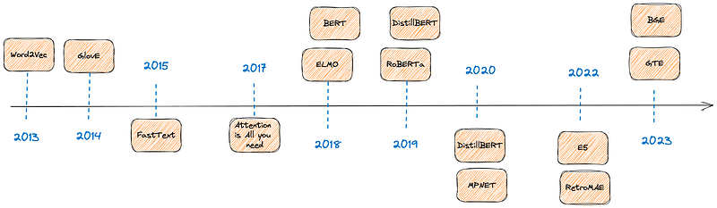
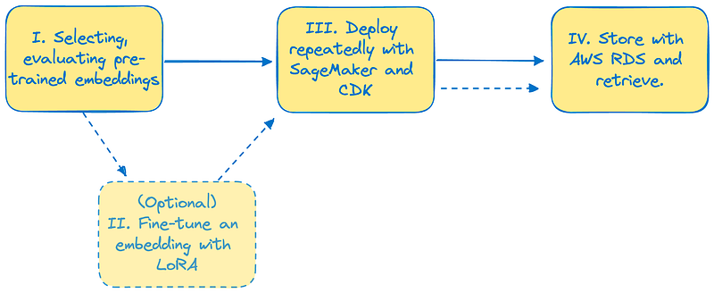

# Blog series introduction: why embeddings matter in generative AI area

The year 2023 marks an overlooked anniversary: it's been 10 years since Word2Vec was released. This paper presented semi-supervised approaches to train dense representation of a word based on its surrounding companions. Looking further, the very idea of looking at context when studying language is not quite new: it dates back to John Rupert Firth, an English linguist, who wrote, back in 1957 :
 
> *"You shall know a word by the company it keeps*"

Since 2013, words and sentence embeddings are vehicles that revolutionized the way we process exabytes worth of textual data, and multiple applications have emerged to leverage them: recommender systems, sentiment analysis classifiers, search engines…

Moreover, on the research aspect, text-based machine learning growth has at least a yearly copernican revolution, including transformers, which enforced the context-based embeddings.

Embeddings are becoming the backbone of many tasks encompassing various levels of expertise. 
* For NLP researchers, they're the backbone of encoder/decoder and encoder-only architectures. 
* For NLP practitioners, we can reuse them for further tasks. 
* For database/datastore administrators, they help in building scalable vector stores. 
* For genAI-powered applications developers, they effectively help in preventing hallucinations by building retrieval augmented generation systems (RAG): 
    * indeed, not only the current LLM hype is based on embeddings, but, in return, embeddings are also crucial on the actual professional use case of Retrieval Augmented Generation in Generative AI. 
    * This use-case can reduce hallucinations: said otherwise, you can build systems where your GenAI app prompt will rely on an embeddings-based search system to provide a truthful answer. Thus, you'll get _best of both_ worlds: an off-the-shelf LLM on one hand, and, on the other hand, your bespoke search system handcrafted upon your organization's knowledge.

## History and formulas are fine, but just give me the codes!

This series of blog posts aims at providing help for effectively selecting, evaluating and deploying and storing pre-trained embeddings with the help of AWS services. I'll briefly introduce some concepts and I'll provide codes, notebooks and infrastructure as a code (IaC) with CDK so that you can deploy your own state-of-the-art embedding system in a repeatable, robust manner. In order to do so, your companion for this blog series will be  the following Github repository, simply called [_cloud-embeddings_](https://github.com/mNemlaghi/cloud-embeddings/tree/main) 😁.

## Word embeddings: a historical perspective

Word embeddings are a vehicle that allow computers to turn words into vectors, and thus to perform operations on words. By extension, sentence embeddings turn a sentence into a vector. Said otherwise, we can see it as a mapping function between a word - or, more interestingly, a sequence of words - and a vector. Embeddings are aimed at capturing semantic relationships between words. We won't deep dive into this part today, but the interested reader can find some foundational links below to gain a historical perspective on this.

* Mikolov's [Word2vec](https://arxiv.org/abs/1301.3781) 
* [Glove](https://nlp.stanford.edu/projects/glove/)
* [fastText]( https://fasttext.cc/)
* [Attention is all you need](https://arxiv.org/abs/1706.03762)
* [ELMo](https://arxiv.org/abs/1802.05365)
* [BERT](https://arxiv.org/pdf/1810.04805.pdf)

To summarize, embeddings are the backbone of current AI hype, especially in their text-based flavor.

## Suggested reading order

While parts are aimed at being loosely coupled, here's a humble suggestion of reading order.

* Part 1: [selecting and evaluating pre-trained state-of-the-art embeddings models](https://mnemlaghi.github.io/cloud-embeddings/part-one-evaluate) .
* Part 2 (optional): [Fine-tune a state-of-the-art embedding model](https://mnemlaghi.github.io/cloud-embeddings/part-two-finetune)
* Part 3: [deploying embedding systems with SageMaker, Bedrock and CDK](https://mnemlaghi.github.io/cloud-embeddings/part-three-deploy)
* Part 4: [storing embeddings and creating a retriever with Bedrock Knowledge Bases](https://mnemlaghi.github.io/cloud-embeddings/part-four-store)
* Quantizing embeddings: [Squeezing Embeddings: A Journey from classic to rotated ternary quantization](https://mnemlaghi.github.io/cloud-embeddings/quantization)

