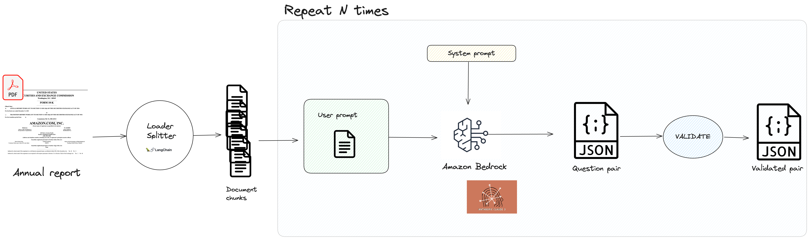

#### _The Embedding Adapters Series_
# Synthetic Data Generation for Financial Q&A Systems

##  Introduction: The Need for Synthetic Data

In our quest to decode annual reports (see [here](https://mnemlaghi.github.io/embedding-adapters) ), as usual, all begins with a proper data curation & preparation. The challenge in building more precise question-answering systems, as in any AI-related problem, is the scarcity of resources to label them. 

## The role of Large Language Models

Traditionally, we've needed people to craft and review data manually.

 Large Language Models (LLMs) have proven themselves increasingly trustworthy, such as this [recent popular paper covering RAG long-context windows](https://arxiv.org/pdf/2407.01370) in understanding text, therefore being able to ask questions upon them, opening new possibilities for synthetic data generation, such as stated in this [survey article](https://arxiv.org/html/2406.15126v1)


In this post, we'll explore how to leverage a LLM, specifically Anthropic's Claude Sonnet, to generate question-answer pairs from parts of financial documents. Along the way, we'll also learn how to benefit from Amazon Bedrock's Converse API to ensure a systematic, structured output.

Key points we'll cover:
- Using LLMs for synthetic data generation in financial contexts
- Implementing the generation process with Claude Sonnet
- Leveraging Amazon Bedrock's Converse API for structured outputs

These synthetically generated questions will later help us in training the adapter, forming the foundation of our improved financial Q&A system.


##  Code & general workflow

Most of the code can be found within this part of the [companion repository](https://github.com/mNemlaghi/rag-adapters/blob/main/synthetic/qa_pair_generation.py).


Here is how we are going to proceed.


##  Synthetic Data Generation Process: for a single question-answer pair

I implemented the `SyntheticDataGenerator` class, which covered the general workflow. Let's review main parts of the code:


### Source document loading and chunking

In the system, I used the publicly accessible [EDGAR system from U.S Securities and Exchange Commission](https://www.sec.gov/search-filings) in order to get Amazon report for fiscal year 2023, in a PDF format. Nothing fancy, right :-) . Next, how are we going to divide our document into text parts, so that every part can itself contain a question to answer to?

This is where I leverage the use of `langchain` a framework allowing us to rapidly prototype LLM aplications.

```python
from langchain_community.document_loaders import PyPDFLoader
from langchain.text_splitter import CharacterTextSplitter


def read_10k_earnings(document_path):
    loader = PyPDFLoader(document_path, extract_images=False)
    splitter = CharacterTextSplitter(separator = "\n", chunk_size = 1024, chunk_overlap=100)
    pages = loader.load_and_split(splitter)
    return [p.page_content for p in pages]
```

For the sake of the example, I used a very basic splitting strategy. Now, every chunk will have 1024 character, with 100 characters overlap between chunks. In our case, it formed a document of 340 text chunks.


###  Designing the Prompt

Now, for each chunk, we are going to form at least one question, thanks to Claude Sonnet LLM. We're going to distinguish system prompt from user prompt

#### System prompt

System prompt sets the overall context, role and behavior for the LLM. 

> ```
> You are a helpful expert in financial information retrieval. 
> You excel at asking questions from 10k earnings that are diverse and know how to answer them with 10k earning documents.
> You know how to minimize bias.
> Your goal is to ask realistic and specific questions that can likely be asked for automated financial reporting. 
>  ```


#### User prompt

User prompt, on the other hand, contains the specific input that the LLM should respond to.

> ```
> Based on the text chunk below, generate one question - answer pair that has a question, alongside a relevant passage from the text > chunk.        <text_chunk>
> <text_chunk>
> {chunk}
> </text_chunk>

Question needs to be specific.
```

In Python, it goes with f-strings:

```python
def build_base_prompt(self, chunk):

    specified_prompt = f""".
    Based on the text chunk below, generate one question - answer pair that has a question, alongside a relevant passage from the text chunk.        <text_chunk>
    <text_chunk>
    {chunk}
    </text_chunk>

    Question needs to be specific.
    """
```


### Ensuring JSON output with Bedrock Converse API.

Reliability and reproducibility are key. Enforcing JSON output is crucial for ensuring structured, consistent, and easily parsable responses from LLM. Thanks to [Amazon Bedrock's Converse API](https://community.aws/content/2hWA16FSt2bIzKs0Z1fgJBwu589/generating-json-with-the-amazon-bedrock-converse-api?lang=en), we can now define a specific JSON schema as part of the tool configuration, which guides the model to generate responses in the desired format. Let's quickly go through our way of enforcing JSON output in our case.


#### Define the tool specification
We create a JSON schema for the desired output structure (question-answer pair)

```json
{
  'type': 'object',
  'properties': {
    'pair': {
      'type': 'object',
     'required': ["question", "answer"],
      'properties': {
        'question': {
          'type':'string',
          'description': 'A short question that can be answered from the chunk'
        },
       'answer': {
          'type':'string',
          'description':'a sentence solely from the document that answers accurately the question'
        }
      }
    }
  }
}
```

Finally, we wrap it in a `toolSpec` object with a name and description. In Python, it goes this way, assuming we encapsulated the previous JSON schema as a dictionary variable called `pair` :

```python
desc = """Generate  a pair of question and answer, based on a text chunk . It must include: 
- a question that can be answered from a document
- a passage from the text chunk that accurately answers the question, called 'answer'
"""

tool_spec = {"toolSpec":{
    "name":"pair_generator", 
    "description":desc, 
    "inputSchema":
        {"json":pair}
    }
}
```

#### Set up & make the API call:

In a nutshell, the rest happens pretty naturally:
   - Construct the user message with the user prompt
   - Configure inference parameters (e.g., max tokens, temperature)
   - __Include the tool specification in the `toolConfig` argument__
   - Add a system prompt to set the overall context
   - Use the Bedrock runtime boto3 client's `converse` method
   - Pass in the model ID, messages, inference config, and tool config.

... And that's it! Now the LLM will generate an question answer pair. 

In my case, I used 

Here is an example 

```json
{
    'question': 'What is the time period over which Judith McGrath adopted a trading plan to sell up to 5,760 shares of Amazon.com, Inc. common stock?',
    'answer': 'On November 27, 2023, Judith McGrath, Director, adopted a trading plan intended to satisfy Rule 10b5-1(c) to sell up to 5,760 shares of Amazon.com, Inc. common stock over a period ending on March 8, 2024, subject to certain conditions.'
 }
```

Now, what about generating 500 question-answer pairs?

##  Generating  multiple data points from a single document.


Always within the `SyntheticDataGenerator` class, the  `generate_pairs` method is designed to create a specified number of question-answer pairs from the given document chunks. Here's how it works:

1. It starts with a target number of pairs to generate (N).
   
2. It keeps track of how many times each chunk has been used to generate questions.

3. The method runs in a loop, trying to generate N pairs:
   - It selects a chunk that hasn't been used much (or at all) yet.
   - It calls `generate_one_pair` on this chunk, which in turn uses the `atomic_invoke` method to create a Q&A pair.
   - If successful, it adds the new pair to the collection.

4. To ensure diversity, it prioritizes chunks that have been used less often.

5. It has a maximum number of attempts (2N) to avoid getting stuck if generation becomes difficult.

6. The method handles errors gracefully, pausing briefly if there's an issue before trying again.

This approach aims to create a diverse set of Q&A pairs while efficiently using all parts of the document and managing potential generation challenges.


##  What could we do better?

Here is a non exhaustive list of limitations:

1. We need to put guardrails so that LLM can efficiently focus on generating finance/accounting related questions.
2. This is a basic example: We can play with the `build_base_prompt`  in order to add previous asked questions in the 
3. We can add question categories, always in the `build_base_prompt` , in order to encourage more diverse, targeted question categories.
4. I added a placeholder for the `validate_output` method, but method should be business-proof (maybe using another LLM as a judge ?)
5. Of course, adding guardrails to counter toxicity can be added.
6. 


## Next Steps: The Adaptation Continues...


And that's a wrap! We've successfully generated synthetic question-answer pairs using Anthropic's Claude Sonnet and Amazon Bedrock's Converse API. This is a first milestone in our journey to create a more precise financial Q&A system. By leveraging the power of LLMs, we've already solved a crucial business problem: labeling data.

But, as we know, the journey doesn't end here. In the next post, we'll dive deeper into the world of embedding adapters and explore how we can use these synthetic question-answer pairs to train a more accurate and informative financial Q&A system. Stay tuned!


__Notes__:The information provided in this series is for educational purposes only and should not be considered as financial or investment advice. Please read our full [Investment Disclaimer](disclaimer) for more details.