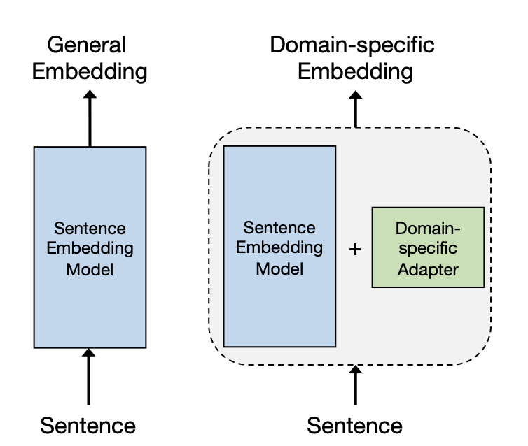
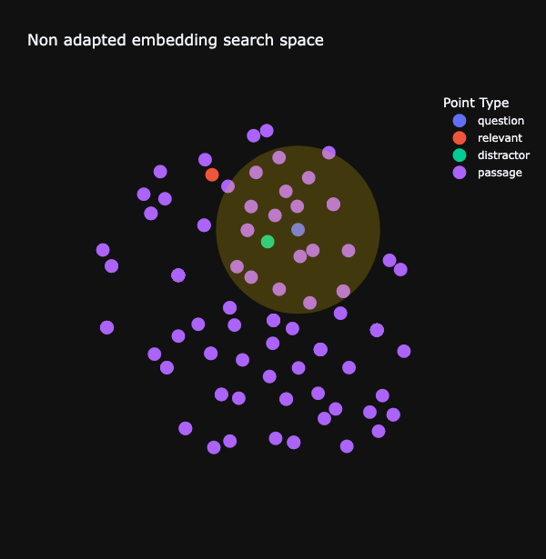
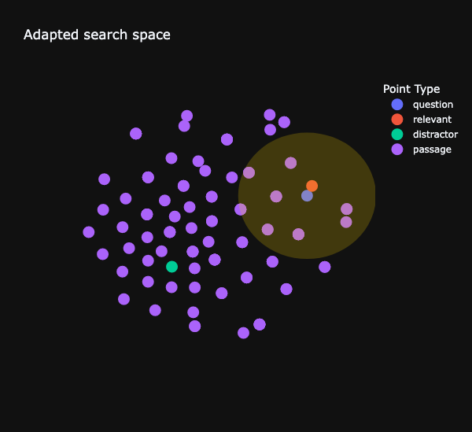
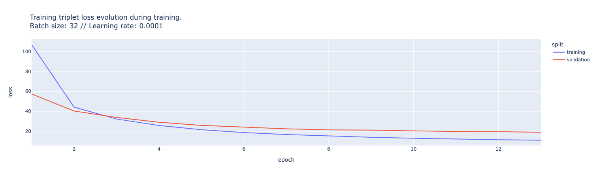

#### _The Embedding Adapters Series_
# Embedding Adapters for Financial Q&A: Part 2 - Training for Precision

## Introduction: From Synthetic Data to Specialized Embeddings

Welcome back! In our last [adventure](part-one-data-generation), we explored how to leverage LLMs to generate synthetic question-answer pairs from financial documents. Now, we're taking those pairs and using them to train embedding adapters that will supercharge our financial Q&A system. 

But what exactly is an adapter, and why is it so useful for our task? Let's dive in!

__NB__: the companion repository has a dedicated part to these embedders, [here](https://github.com/mNemlaghi/rag-adapters/tree/main/adapters)

## What is an Embedding Adapter?

Think of an embedding adapter as a specialized translation layer for our pre-trained embeddings. Generally, when we specialize, we fine-tune an existing model. However, in this case, since we can't change an API-based embedding model, we only add a smaller transformation to the initial embedding. A good explanation appears in 2023 in this [research article](https://arxiv.org/pdf/2307.03104).



Source: [article](ttps://arxiv.org/pdf/2307.03104).


Here's the key idea of adaptation:

1. We start with a proprietary embedding model.
2. Since we don't have access to the embedding model, we add a small, trainable layer – the adapter over the embedding.
3. This adapter learns to "translate" the general embeddings into ones that are more suited for our specific task, hereby reading financial data.

In technical terms, an adapter is a learned transformation that modifies existing embeddings. It's typically implemented as a small neural network layer that sits on top of the pre-trained embeddings. 

They transform an embedding of dimension _d_ into another embedding of dimension _d_. For instance, if we have a proprietary embedding _X_, then we can just learn a matrix of dimension (d,d) that transform X into another embedding Y, so that as _Y=AX_.

Let's purse with the matrix example. In our case, since embedding dimension is 1024 for Cohere v3, therefore, learning such a matrix would involve to learn `d x d` , so around 1M. Nothing that we can't handle, with the mere help of a laptop!


Let's think of it visually. Embeddings are representation of text, aren't they? Let's assume we have only 2 dimensions, so we can see them as points in a 2D map. In this weird space, we need to:

1. maximize relevancy: the representation of the question to be as close as possible from the representation of the _relevant_ answer;
2. minimize distractors: the representation of the question to be as far as possible from representation of _irrelevant_ answers.


So we need to create a new space where these two conditions happen.
Think of the retrieval system as a street lamp projecting a light only around the question point. In the initial search space, the retrieval system would likely retrieve irrelevant answers, as shown below:




In the adapted space - the new map enabled by the adapter, chances are high question becomes really closer to the relevant answer, and puts away distractors.



We'll dig deeper on how we can visualize and interpret adapters in the next part of this series.

So, in a nutshell, the beauty of adapters is that they allow us to fine-tune for specific tasks with minimal additional parameters, preserving the general knowledge of the original embeddings while adding task-specific expertise.


## The Power of Triplet Loss: Teaching Financial Relevance Through Comparison

It's now time to introduce our key technique in the quest : triplet loss. It will be our companion to effectively learn adapters. 
You wouldn't just hand them a stack of 10-Ks and say "Good luck!" Instead, you'd teach them through comparison. That's exactly what triplet loss does for our AI. Originally, the very notion of triplets is not nascent. It appeared in [2010](https://www.jmlr.org/papers/volume11/chechik10a/chechik10a.pdf), to compare images.

Here's how it works:

1. We show our AI a financial question (let's call this the "anchor").
2. We then present two pieces of information:
   - The correct answer from the annual report (the "positive" example)
   - An irrelevant bit of financial information (the "negative" example or "distractor")


[Source: Wikipedia](https://en.wikipedia.org/wiki/Triplet_loss)


Now, here's the interesting part. We instruct our AI: "Make sure the question (anchor) is closer to the correct answer (positive) than it is to the irrelevant info (negative)."


In mathematical terms, triplet loss encourages our adapter to transform embeddings so that:
- The distance between the question and correct answer embeddings is minimized.
- The distance between the question and irrelevant info embeddings is maximized.

Why is this so useful? Because it teaches our AI to understand relevance in a *relative* sense. It's not just memorizing answers; it's learning to distinguish between relevant and irrelevant information in a very specific vertical.

Think about it: in the annual reports real world, the difference between a crucial financial insight and an irrelevant tidbit can be subtle. By using triplet loss, we're training our AI to make these nuanced distinctions, similar to how an expert financial analyst would.

Another advantage: this approach is data-efficient. We don't need millions of labeled examples. With our synthetic Q&A pairs and this comparative learning approach, we can achieve good results with less data than traditional methods.


Now that we've explained the concept of triplet loss, let's see how we prepare our data to use this technique effectively.

## From Pairs to Triplets: Preparing Our Training Data


To train our adapter effectively, we transform our question-answer pairs into triplets. Here's how:

1. We start with a question and its correct answer from our synthetic data.
2. We then add a "distractor" - an incorrect answer from another part of the document.

This triplet structure (question, correct answer, distractor) is crucial for our training process, as it allows our model to learn by comparison.

We can simply achieve that via a simple routine in Pandas: 

```python
import pandas as pd
import random
from tqdm.auto import tqdm

def augment_one_example(pair, final_pairs, sample_ratio = 0.2):
    

    df = pd.DataFrame(final_pairs).sample(frac=sample_ratio)
    id = pair['id']
    newdf=df.query(f"id!={id}").copy()
    newdf.loc[:,'question']= pair['question']
    newdf.loc[:,'relevant']= pair['answer']
    newdf=newdf.rename({"answer":"distractor"}, axis = 1)
    return newdf

random.shuffle(final_pairs)

dfs = []
for p in tqdm(final_pairs):
    dfs.append(augment_one_example(p, final_pairs, sample_ratio=0.3))

augmented_df = pd.concat(dfs)
augmented_triplets = augmented_df.to_dict(orient = "records")
```

For each question answer pair, we add 30% of the whole dataset, achieving an augmentation of a factor x150. And now, we proverbially split the data between train and validation sets.

```python
train_size = int(0.75*len(augmented_triplets))

random.shuffle(augmented_triplets)

train_triplets = augmented_triplets[:train_size]
valid_triplets = augmented_triplets[train_size:]
```

## Embedding Computation: Transforming Text to Numbers

Before we dive into training our adapter, it's important to understand how we transform our textual data into a format our model can work with. This process is called embedding computation.

We use two main classes for this:

1. `CohereChromaEmbedder`: This is our baseline embedder, which converts text into numerical representations using a pre-trained model.
2. `AdaptedCohereChromaEmbedder`: This class applies our adapter to the baseline embeddings, creating specialized representations for our financial domain.

The name's origin is not very intersting: we chose Cohere Embeddings, and we want them to be compliant with ChromaDB options, a vector database that we'll use in part four to compare our RAG systems. Cohere+Chroma 🤷🏻‍♂️

These embedders efficiently convert our questions, relevant answers, and distractors into high-dimensional vectors. While the technical details of this process involve complex caching and optimization strategies, the key point is that these embeddings allow our model to understand and compare the semantic meaning of different pieces of text.


## The Training Loop: Iterative Financial Wisdom

Having a data, having a loss, now training is almost procedural. I chose PyTorch framework for its flexibility, but please bear in mind that I could have chosen any framework or model. I tested two models: one simple linear layers, and a concatenation of two linear layers.

```python
import torch.nn as nn
import torch.nn.functional as F

class LinearLayer(nn.Module):
    def __init__(self, d):
        super(LinearLayer, self).__init__()
        self.l1 = nn.Linear(d, d)
    
    def forward(self, X):
        return self.l1(X)
    

#Or try reduced version
class ReducedLinearLayer(nn.Module):
    def __init__(self, d, d_hidden):
        super(ReducedLinearLayer, self).__init__()
        self.l1 = nn.Linear(d, d_hidden)
        self.l2 = nn.Linear(d_hidden, d)
    
    def forward(self, X):
        return self.l2(F.relu(self.l1(X)))    
```


Training loop is somehow classic in PyTorch, and can be seen in its repository context [here](https://github.com/mNemlaghi/rag-adapters/blob/main/adapters/trainer.py)

1. Pass batches of triplets through our adapter.
2. Compute the triplet loss to measure how well our adapter distinguishes between relevant and irrelevant information.
3. Update the adapter's parameters to minimize this loss.



With each iteration, the adapter becomes more attuned to the nuances of financial language and relevance.

## What's Next: Evaluating and interpreting our 10K assistant

By training these embedding adapters with triplet loss, we're creating a specialized tool for financial Q&A. We're teaching our AI to not just understand financial language, but to make nuanced distinctions between relevant and irrelevant information in complex financial documents.

In the next post, we'll put our newly trained adapter to the test, evaluating its performance in distinguishing relevant financial information from distractors.


__Notes__:The information provided in this series is for educational purposes only and should not be considered as financial or investment advice. Please read our full [Investment Disclaimer](diclaimer) for more details.